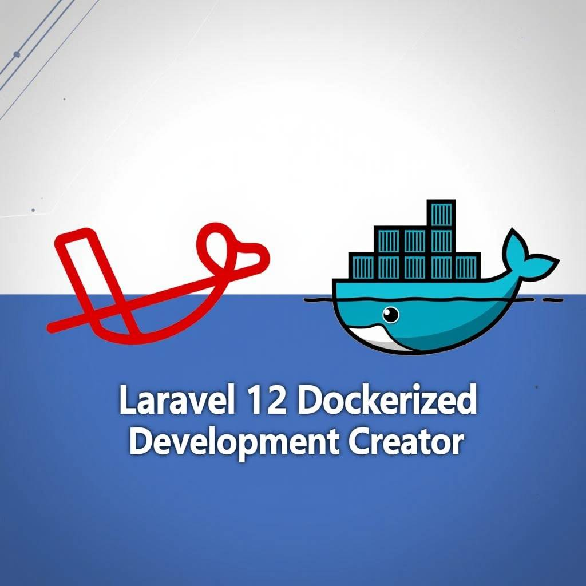

<p align="center">
  <a href="" rel="noopener">
 </a>
</p>

<h1 align="center">Laravel 12 Dockerized Development Creator</h1>

<div align="center">

[]()

[](https://github.com/jfheinrich-eu/laravel-dockerized-dev-creator/issues)
[](https://GitHub.com/Naereen/StrapDown.js/pull/)
[](/LICENSE)

</div>

---

<p align="center"> Creator for a dockerized Laravel 12 development environment
    <br>
</p>

<h2>Table of Contents</h2>

- [About](#about)
- [Getting Started](#getting-started)
  - [Requirements](#requirements)
- [Usage](#usage)
- [Authors](#authors)


## About

This repository covered the tools to create a complete dockerized development environment for a Laravel 12 Livewire Fotify installation.

## Getting Started

With this repository you get the toolchain to create a sandbox for Laravel 12 development.

Following services will be created and startet within docker, no changes on your host system needed.

Services:

- app: Service with full Laravel stack
- webserver: NGINX based HTTP service setup: [http://localhost:8080](http://localhost:8080)
- db: MySQL 8.x database service
- phpmyadmin: [http://localhost:8888](http://localhost:8888)
- redis: REDIS cache system
- mailpit: Fake mail service, to cover all mail which will be send: [](http://localhost:8825)
- redisinsight: Web service for the redis service: [http://localhost:5540](http://localhost:5540)

### Requirements

All what you need is a running docker installation!

## Usage

After you clone this repository, you need following steps to get a development environment stack:

```bash
cd [repository root]

# customize the install environment file
nano .env

# Create the files Dockerfile, docker-compose.yml and laravel-default-env
./create.sh

# Create the docker container
docker compose up --build -d

# Install Laravel 12 Livewire Fortify
docker compose exec app /laravel-install.sh

# Restart the `app` container
docker compose restart app
```

Now you can access the Laravel installation with [http://localhost:8080](http://localhost:8080)

## Authors

- [@jfheinrich](https://github.com/jfheinrich) - Idea & Initial work

See also the list of [contributors](https://github.com/jfheinrich-eu/laravel-dockerized-dev-creator/contributors) who participated in this project.
